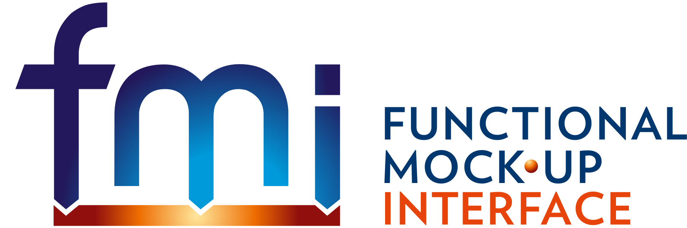

= Functional Mock-up Interface

The Functional Mock-up Interface (FMI) is a tool independent standard that defines an interface to be used in computer simulations to develop complex cyber-physical systems.

== Building the Specification

The FMI specification is written in http://asciidoc.org/[AsciiDoc], a plain-text mark-up format that can be converted to HTML, DocBook, PDF and other formats. To build the documentation locally

. https://www.ruby-lang.org/en/downloads/[Install Ruby]

. Install the https://asciidoctor.org/#installation[AsciiDoctor Ruby gem]

. https://help.github.com/articles/cloning-a-repository/[Clone] the repository

  git clone https://github.com/t-sommer/fmi-standard.git

. Change into the `docs` folder

  cd docs

. Generate the HTML document

  asciidoctor -b html5 fmi_specification.adoc

The generated `fmi_specification.html` can be viewed with any modern web browser.
